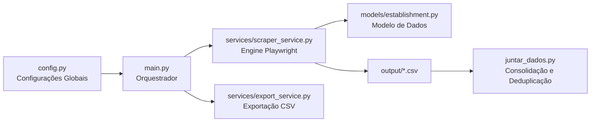
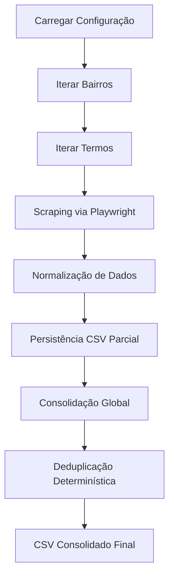

<div align="center">

# 🗺️ GMaps Playwright Scraper  
### Modular Local Business Data Extraction Engine

<p>
  
  
  
  
</p>

<p>
  Engine de scraping modular para extração estruturada  
  de dados públicos do Google Maps com persistência incremental  
  e consolidação determinística.
</p>

</div>

---

#  Objetivo

Construir um **motor resiliente de coleta de dados geolocalizados**, com:

- Segmentação por bairro
- Extração baseada em renderização real (Chromium)
- Estratégias básicas de mitigação de bloqueios
- Persistência tolerante a falhas
- Consolidação determinística de resultados

---

#  Arquitetura Atual

O projeto segue uma **arquitetura modular em camadas**, com separação clara entre configuração, orquestração, serviços e modelo de dados.




#  Estratégia Técnica

##  1. Navegação Determinística

Evita interação excessiva com a UI sempre que possível.  
As URLs de busca são construídas diretamente para reduzir dependência de cliques e heurísticas frágeis.

---

##  2. Extração Baseada em Renderização

Em vez de depender exclusivamente de atributos HTML instáveis:

- Captura texto renderizado na página
- Aplica Regex sobre o texto visível
- Exemplo extraído: `4,8 (1.205)`

Isso reduz quebras causadas por mudanças estruturais frequentes do Google Maps.

---

##  3. Mitigação de Bloqueios

- User-Agent realista (Chrome / Windows)
- Scroll incremental
- Delays randômicos
- Controle implícito de taxa por bairro

---

##  4. Persistência Incremental

Cada bairro gera um CSV independente.

Benefícios:

- Recuperação após falha
- Execução interrompida não perde dados anteriores
- Permite futura paralelização

---

##  5. Deduplicação Determinística

A consolidação global utiliza a seguinte chave lógica:

```
Nome + Endereço
```

Isso reduz duplicidade entre bairros limítrofes.

---

#  Estrutura do Projeto

```bash
gmaps-playwright-scraper/
│
├── config.py                 # Configurações globais do scraper
├── main.py                   # Orquestrador principal da execução
├── juntar_dados.py           # Consolidação e deduplicação
├── requirements.txt          # Dependências do projeto
│
├── models/
│   └── establishment.py      # Representação da entidade coletada
│
├── services/
│   ├── scraper_service.py    # Lógica principal de scraping (Playwright)
│   └── export_service.py     # Exportação e manipulação via Pandas
│
├── output/                   # CSVs parciais e consolidados
├── scraper.log               # Log de execução
└── settings.json             # Configurações auxiliares
```

---

# 🧬 Modelo de Dados

`Establishment`

| Campo     | Tipo   | Descrição |
|-----------|--------|------------|
| nome      | str    | Nome do estabelecimento |
| endereco  | str    | Endereço completo |
| telefone  | str    | Telefone público |
| rating    | float  | Nota média |
| reviews   | int    | Quantidade de avaliações |
| bairro    | str    | Bairro da coleta |
| categoria | str    | Termo pesquisado |

---

#  Configuração

Arquivo: `config.py`

| Variável | Papel |
|----------|--------|
| `BAIRROS_BH` | Domínio geográfico da coleta |
| `TERMOS` | Domínio de mercado (ex: pizzaria, academia) |
| `MAX_RESULTS_PER_CITY` | Controle de volume por execução |
| `HEADLESS` | Execução visível ou silenciosa |

---

#  Execução

## 1️⃣ Instalar dependências

```bash
pip install -r requirements.txt
playwright install
```

## 2️⃣ Rodar coleta

```bash
python main.py
```

## 3️⃣ Consolidar dados

```bash
python juntar_dados.py
```

---

#  Pipeline de Execução



---


# ⚠️ Considerações Legais

Projeto destinado a:

- Educação
- Pesquisa de Mercado
- Análise de Dados Públicos

O uso deve respeitar:

- Termos de Serviço da plataforma
- Limites de requisição
- LGPD (Brasil) quando aplicável

---

<div align="center">

### Engenharia modular aplicada a Web Scraping.

</div>